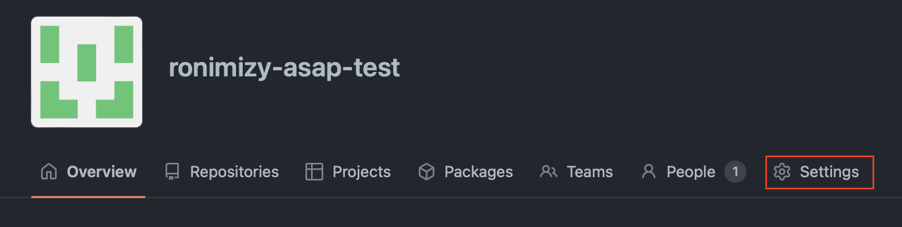
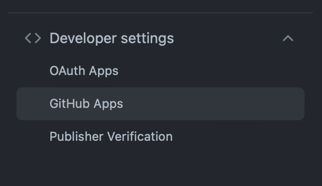
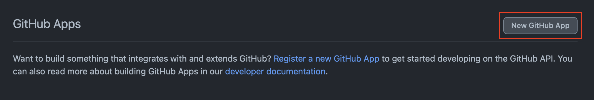
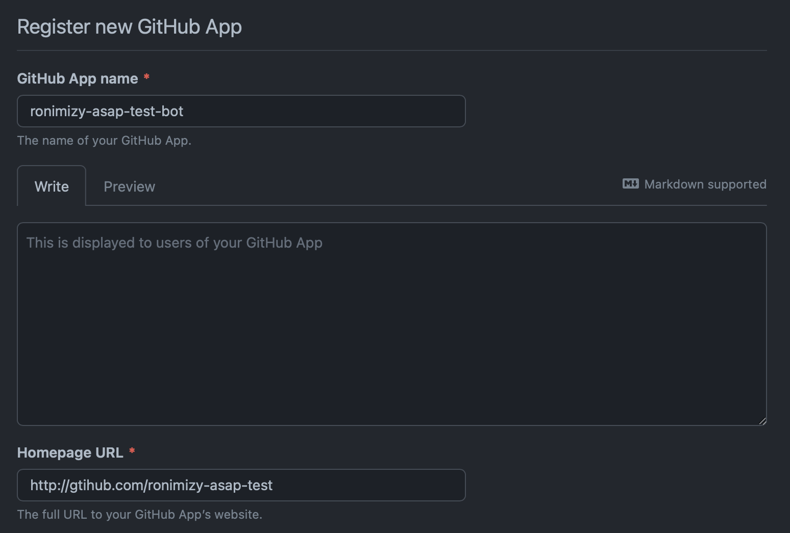
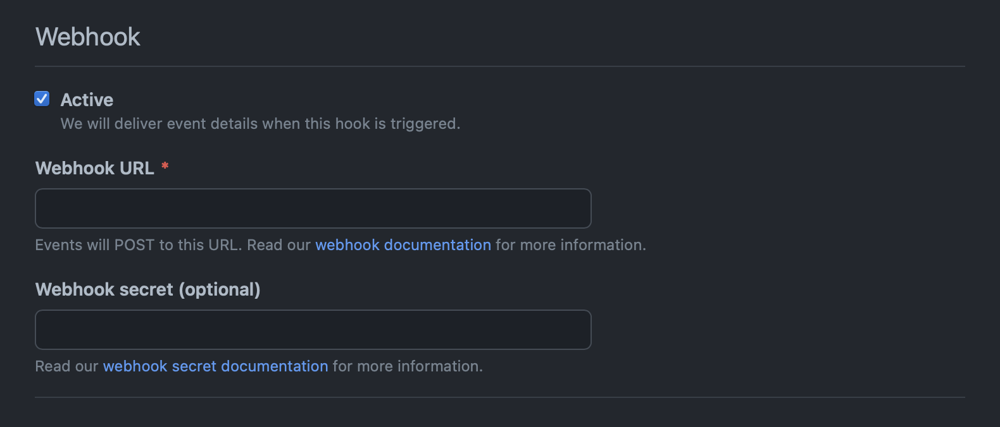
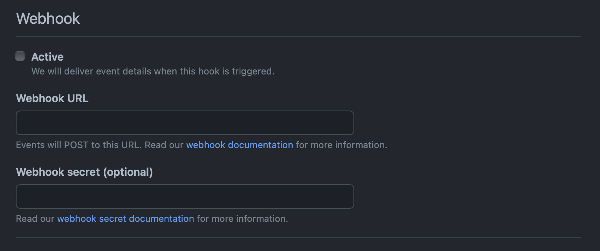
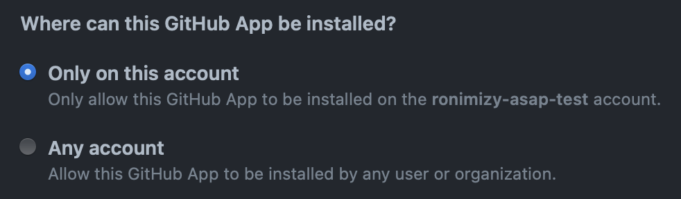
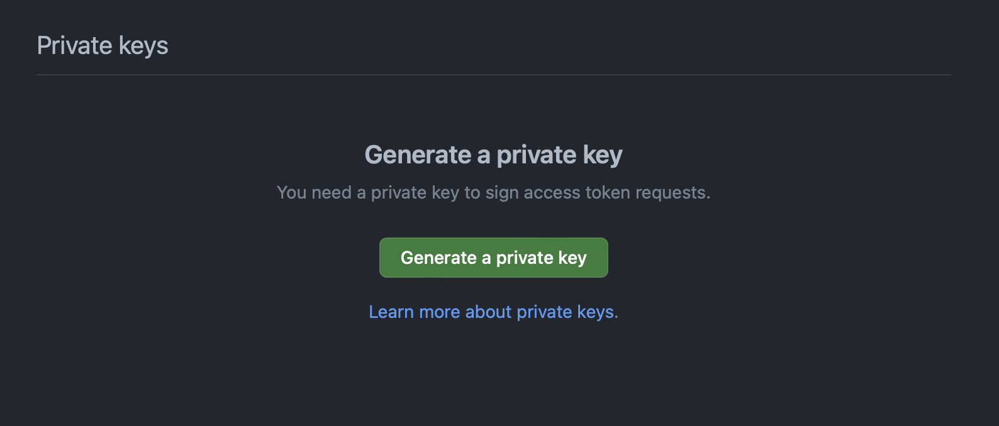
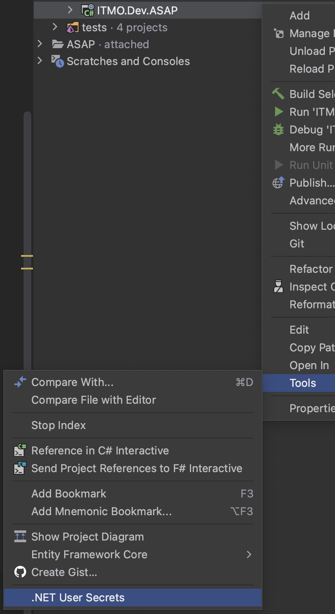
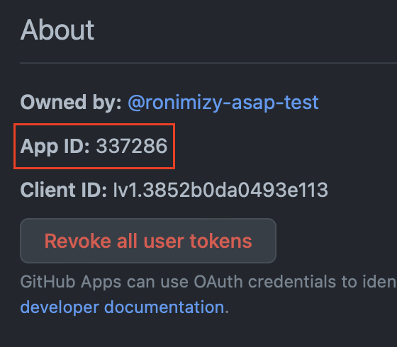

# Local development

Для локальной разработки рекомендуется использовать свою тестовую организацию.
Данный документ описывает шаги, необходимые для этого.

## Создание организации

Создайте тестовую организацию, к которой будет привязан SubjectCourse

## Создание приложеня (бота)

Перейдите в настройки организации



Перейдите в меню `Developer settings GitHub Apps`



Создайте новое приложение



В качестве ссылки укажите ссылку на свою тестовую организацию



Отключите Webhook'и, их можно будет включить дальше, используя [ngrok](https://ngrok.com) для того чтобы получать 
вебхуки на локальную машину

<div style="display: flex;">


</div>

Добавьте `Read and write` permission'ы для 

### Repository permissions
- Administration
- Commit statuses 
- Contents
- Discussions
- Issues
- Packages
- Pull requests

### Organization permissions
- Members
- Team discussions 

Выберите что, приложение может быть установлено только в данной организации



Создайте приложение

Добавьте и скачайте приватный ключ



## Заполнение кофигурации

Откройте `.NET User Secrets` проекта `ITMO.Dev.ASAP`



Скопируйте id вашего приложения 



Добавьте свою организацию как service installation

```json
{
  "Github": {
    "Octokit": {
      "AppId": {APP_ID},
      "PrivateKey": "{YOUR_PRIVATE_KEY",
      "Service": {
        "Organization" : {
          "Enabled" : true,
          "Name": "{YOUR_ORGANIZATION_NAME}"
        }
      }
    }
  }
}
```